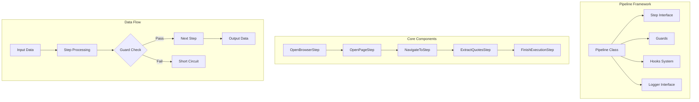
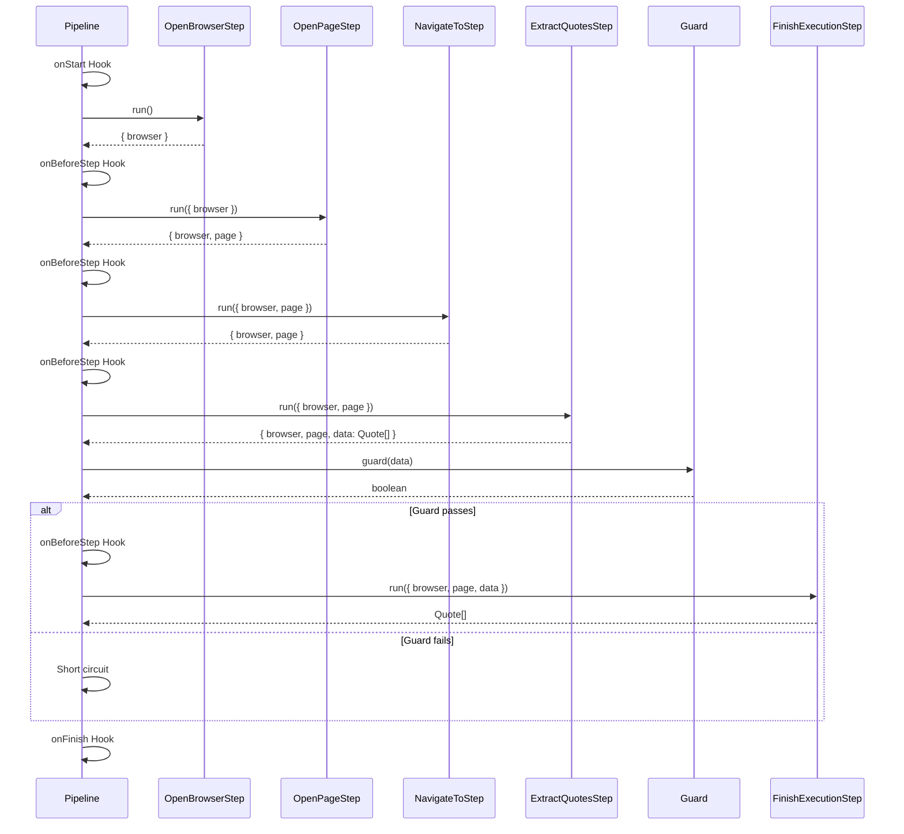
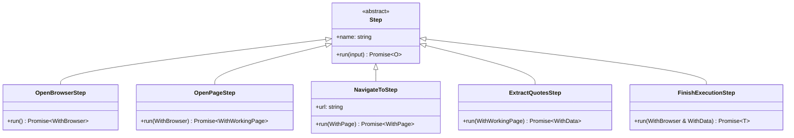
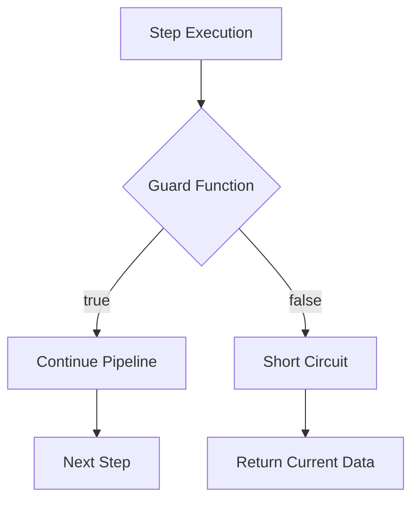
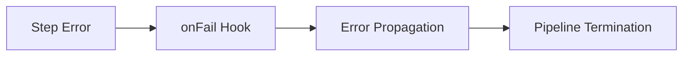

# 🔬 Pipeline Web Scraping Framework

A TypeScript web scraping framework built with a flexible Pipeline architecture using Puppeteer for browser automation.

## 🏗️ Architecture Overview



## 🚀 Quick Start

```typescript
import { Pipeline } from "./pipeline";
import { 
    OpenBrowserStep, 
    OpenPageStep, 
    NavigateToStep, 
    ExtractQuotesStep,
    FinishExecutionStep 
} from "./steps";

async function main() {
    const pipeline = new Pipeline()
        .addStep(new OpenBrowserStep())
        .addStep(new OpenPageStep())
        .addStep(new NavigateToStep("https://quotes.toscrape.com/"))
        .addStep(new ExtractQuotesStep())
        .addGuard((output) => output.data.length > 5)
        .addStep(new FinishExecutionStep());

    const result = await pipeline.run();
    console.log("Scraped quotes:", result);
}
```

## 📊 Pipeline Execution Flow



## 🔧 Core Components

### Pipeline Class

The main orchestrator that manages step execution, guards, and hooks.

```typescript
export class Pipeline<I, O = I> {
  addStep<NextOut>(step: Step<O, NextOut>): Pipeline<I, NextOut>
  addGuard(guard: Guard<O>): this
  setHooks(hooks: PipelineHooks): this
  run(input?: I): Promise<O>
}
```

### Step Interface

Abstract base class for all pipeline steps.

```typescript
export abstract class Step<I, O> {
  name?: string;
  abstract run(input: I): Promise<O> | O;
}
```

### Available Steps



## 🎣 Hooks System

The Pipeline supports lifecycle hooks for monitoring and custom behavior:

```typescript
interface PipelineHooks {
  onStart?: (data?: unknown) => void | Promise<void>;
  onFinish?: (data?: unknown) => void | Promise<void>;
  onBeforeStep?: (data: { stepName?: string; data?: unknown }) => void | Promise<void>;
  onAfterStepSuccess?: (data: { stepName?: string; data?: unknown }) => void | Promise<void>;
  onFail?: (data: { stepName?: string; data?: unknown; error?: unknown }) => void | Promise<void>;
}
```

### Example with Custom Hooks

```typescript
const pipeline = new Pipeline()
    .setHooks({
        onStart: (data) => console.log('🚀 Pipeline started'),
        onBeforeStep: ({ stepName }) => console.log(`⚡ Executing: ${stepName}`),
        onFail: ({ stepName, error }) => console.error(`❌ ${stepName} failed:`, error)
    })
    .addStep(new OpenBrowserStep())
    // ... more steps
```

## 🛡️ Guards

Guards provide conditional execution control:



```typescript
// Only proceed if we found quotes
.addGuard((output: { data: Quote[] }) => {
    console.log(`Found ${output.data.length} quotes`);
    return output.data.length > 0;
})
```

## 📝 Data Types

```typescript
interface Quote {
    text: string;
    author: string;
    tags: string[];
}

interface WithBrowser {
    browser: Browser;
}

interface WithPage {
    page: Page;
}

type WithWorkingPage = WithPage & WithBrowser;
```

## 🗂️ Project Structure

```
src/
├── pipeline/
│   └── index.ts          # Pipeline and Step base classes
├── steps/
│   ├── browser.ts        # Browser management steps
│   ├── scraping.ts       # Web scraping steps
│   ├── types.ts          # Type definitions
│   └── index.ts          # Exports
└── index.ts              # Main entry point
```

## 🔍 Error Handling

The Pipeline automatically catches and propagates errors through the `onFail` hook:



## 📦 Dependencies

- **puppeteer**: Browser automation
- **typescript**: Type safety
- **@types/node**: Node.js types

## 🚀 Running the Project

```bash
# Install dependencies
npm install

# Run the scraper
npm start
```

## 🎯 Features

- ✅ **Type-safe Pipeline**: Full TypeScript support with generic types
- ✅ **Flexible Architecture**: Easy to add new steps and modify behavior
- ✅ **Guard System**: Conditional execution with short-circuiting
- ✅ **Lifecycle Hooks**: Monitor and customize pipeline execution
- ✅ **Error Handling**: Comprehensive error catching and reporting
- ✅ **Browser Automation**: Puppeteer integration for web scraping
- ✅ **Modular Design**: Clean separation of concerns

## 🔮 Future Enhancements

- [ ] Parallel step execution
- [ ] Step retry mechanisms
- [ ] Pipeline composition and nesting
- [ ] Built-in caching layer
- [ ] Metrics and performance monitoring
